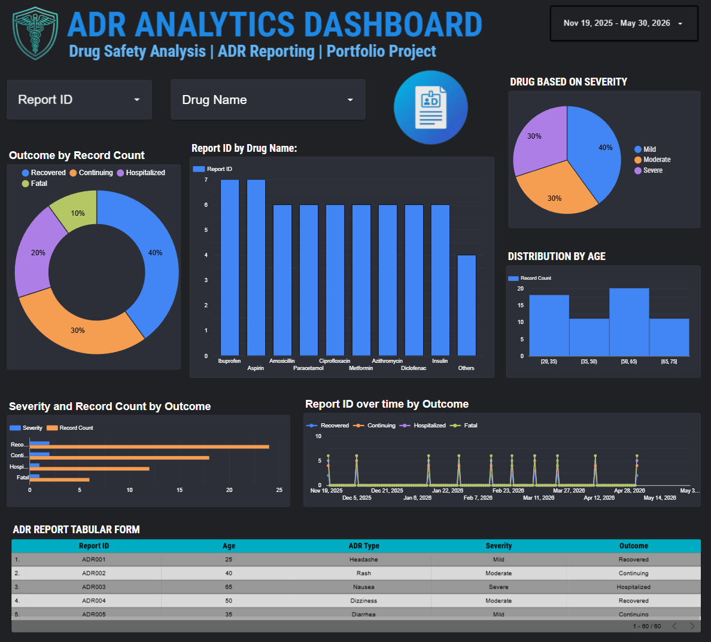

# 📊 ADR Analytics Dashboard

## 💊 Drug Safety Analysis | Pharmacovigilance Portfolio Project

This project demonstrates an interactive Pharmacovigilance (PV) dashboard built using Microsoft Excel and Google Looker Studio.

The dashboard provides insights into Adverse Drug Reaction (ADR) reports through interactive visualizations and filters.

---

## 🚀 Tools Used

- Microsoft Excel
- Google Looker Studio
  

  ## 🔗 Live Dashboard

View the interactive Google Looker Studio dashboard here:

**https://datastudio.google.com/s/ksVd_3g21Iw**

---

## 📈 Dashboard Features

✔ Total ADR Reports

✔ Drug-wise Analysis

✔ Severity Distribution

✔ Outcome Analysis

✔ Age-wise Distribution

✔ Interactive Filters

✔ Tabular ADR Records

---

## 📂 Dataset

- Sample Dataset
- 60 ADR Records

---

## 🧠 Skills Demonstrated

- Pharmacovigilance
- ADR Analysis
- Dashboard Development
- Data Cleaning
- Data Visualization
- Healthcare Analytics
- Excel
- Google Looker Studio

---

## 👨‍💻 Author

**Mayank Singh**
B.Pharm Student | Pharmacovigilance Aspirant
